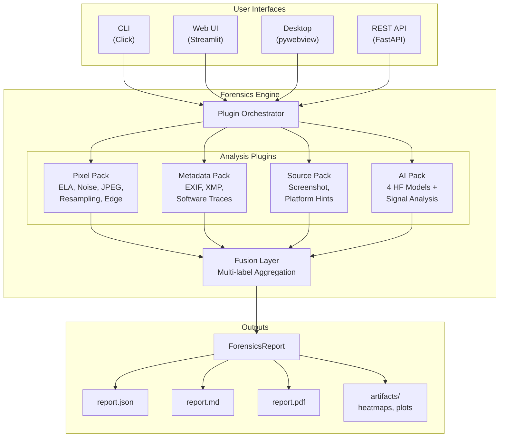

# ImageTrust / Cyber Scout - Architecture Walkthrough

**Master's Thesis Project - Image Forensics & AI Detection System**

**Document Purpose**: Comprehensive technical walkthrough for thesis defense and academic review.

---

## Table of Contents

1. [Executive Summary](#1-executive-summary)
2. [Repository Map](#2-repository-map)
3. [System Architecture Diagram](#3-system-architecture-diagram)
4. [Data & Control Flow](#4-data--control-flow)
5. [Forensics Engine Deep Dive](#5-forensics-engine-deep-dive)
6. [Outputs & Artifacts](#6-outputs--artifacts)
7. [Testing & CI](#7-testing--ci)
8. [Build & Distribution](#8-build--distribution-exe)
9. [Demo Script for Presentation](#9-demo-script-for-presentation)
10. [Future Work](#10-future-work)
11. [Exact Commands to Run](#11-exact-commands-to-run)

---

## 1. Executive Summary

### What is ImageTrust / Cyber Scout?

**ImageTrust** (marketed as **Cyber Scout**) is a forensic desktop application designed to detect AI-generated images and identify digital manipulation. The system combines multiple detection approaches into a unified analysis pipeline that produces explainable, calibrated verdicts.

### Problems Solved

| Problem | Solution |
|---------|----------|
| **AI-Generated Image Detection** | Ensemble of 4 HuggingFace models + frequency/texture signal analysis |
| **Digital Manipulation Detection** | Pixel-level forensics (ELA, noise inconsistency, JPEG artifacts, edge halos) |
| **Metadata/Source Attribution** | EXIF/XMP analysis, software traces, platform hints (WhatsApp, Instagram) |
| **Screenshot/Recapture Detection** | Resolution matching, aspect ratio analysis, compression history |
| **Explainability** | Grad-CAM heatmaps, per-plugin evidence, confidence calibration |
| **False Positive Mitigation** | Multi-label verdicts, UNCERTAIN/INCONCLUSIVE outputs, contradiction detection |

### Core Philosophy

The system follows a **conservative attribution** approach:
- Never claims certainty without sufficient evidence
- Reports confidence levels and limitations for each analysis
- Uses UNCERTAIN/INCONCLUSIVE verdicts when evidence is insufficient
- Treats platform attribution (WhatsApp, Instagram) as "hints" rather than facts

### Deliverables

| Deliverable | Description |
|-------------|-------------|
| **CLI** | Command-line interface for batch analysis and scripting |
| **Web UI** | Streamlit-based interface for interactive analysis |
| **Desktop EXE** | Distributable Windows application (pywebview + Streamlit) |
| **API Server** | FastAPI REST endpoints for integration |
| **Forensic Reports** | JSON, Markdown, and PDF export formats |
| **CI Pipeline** | Automated testing, linting, and build verification |

### Technology Stack

- **Backend**: Python 3.10+, PyTorch, Transformers (HuggingFace)
- **Detection Models**: ResNet, EfficientNet, ViT, 4 pretrained HF detectors
- **Forensics**: PIL/Pillow, OpenCV, SciPy, scikit-image
- **API**: FastAPI, Uvicorn
- **Frontend**: Streamlit, pywebview (native window wrapper)
- **Desktop**: PyInstaller for Windows EXE packaging
- **Testing**: pytest, mypy, black, isort, ruff

---

## 2. Repository Map

### Top-Level Structure

```
imagetrust/
├── src/imagetrust/          # Core source code (Python package)
├── tests/                   # Unit and integration tests
├── scripts/                 # Build, evaluation, and utility scripts
├── configs/                 # YAML configuration files
├── assets/                  # UI templates and backgrounds
├── docs/                    # Documentation and thesis materials
├── .github/workflows/       # CI/CD pipeline definitions
├── outputs/                 # Generated evaluation outputs (gitignored)
├── reports/                 # Generated forensic reports (gitignored)
├── models/                  # Model weights cache (gitignored)
├── data/                    # Datasets (gitignored)
├── docker/                  # Docker configuration
├── main.py                  # CLI entry point
├── CyberScout.spec          # PyInstaller spec for desktop app
├── ImageTrust.spec          # PyInstaller spec for Qt desktop app
├── Makefile                 # Development commands
├── pyproject.toml           # Python project configuration
└── requirements.txt         # Production dependencies
```

---

### `src/imagetrust/` - Core Source Code

This is the main Python package containing all application logic.

#### `src/imagetrust/core/` - Configuration & Types

| File | Role | Key Classes |
|------|------|-------------|
| `config.py` | Pydantic Settings, environment-driven configuration | `Settings` |
| `types.py` | Pydantic models for data structures | `DetectionVerdict`, `Confidence`, `DetectionScore` |
| `exceptions.py` | Custom exception hierarchy | `ImageTrustError`, `InvalidImageError` |

**Inputs**: Environment variables, YAML config files
**Outputs**: Validated configuration objects

#### `src/imagetrust/detection/` - ML Detection Module

| File | Role | Key Classes |
|------|------|-------------|
| `detector.py` | Main detection orchestrator | `AIDetector` |
| `multi_detector.py` | Multi-model ensemble (4 HF models + signals) | `ComprehensiveDetector` |
| `calibration.py` | Probability calibration (Temperature, Platt, Isotonic) | `CalibrationWrapper`, `compute_ece()` |
| `preprocessing.py` | Image normalization and augmentation | `ImagePreprocessor` |
| `copy_move_detector.py` | Splicing/copy-move forgery detection | `CopyMoveDetector` |
| `generator_identifier.py` | AI generator attribution (DALL-E, Midjourney, SD) | `GeneratorIdentifier` |
| `models/` | Individual detector implementations | `CNNDetector`, `ViTDetector`, `HuggingFaceDetector`, `EnsembleDetector` |

**Inputs**: PIL Image, image path
**Outputs**: Detection scores, verdicts, confidence levels

#### `src/imagetrust/forensics/` - Plugin-Based Forensics Engine

| File | Role | Key Classes |
|------|------|-------------|
| `base.py` | Plugin architecture foundation | `ForensicsPlugin`, `ForensicsResult`, `PluginCategory` |
| `engine.py` | Plugin orchestration and report generation | `ForensicsEngine`, `ForensicsReport` |
| `fusion.py` | Multi-label verdict aggregation | `FusionLayer`, `ForensicsVerdict`, `VerdictLabel` |
| `pixel_forensics.py` | Pixel-level analysis plugins | `ELADetector`, `NoiseInconsistencyDetector`, `JPEGArtifactsDetector`, `ResamplingDetector`, `EdgeHaloDetector` |
| `metadata_forensics.py` | Metadata extraction and analysis | `MetadataAnalyzer`, `SoftwareTracesDetector`, `ThumbnailMismatchDetector` |
| `source_detection.py` | Source/platform attribution | `ScreenshotDetector`, `PlatformDetector`, `CompressionHistoryDetector` |
| `ai_detection.py` | AI detection wrapper | `HuggingFaceAIDetector` |

**Inputs**: Image file (PIL Image + raw bytes + file path)
**Outputs**: `ForensicsReport` with multi-label verdicts, evidence, artifacts

#### `src/imagetrust/baselines/` - Thesis Baseline Implementations

| File | Role | Key Classes |
|------|------|-------------|
| `base.py` | Abstract baseline interface | `BaselineDetector`, `BaselineConfig` |
| `registry.py` | Baseline registration and retrieval | `get_baseline()`, `@register_baseline` |
| `classical_baseline.py` | B1: LogReg/XGBoost on forensic features | `ClassicalBaseline` |
| `cnn_baseline.py` | B2: ResNet50 single model | `CNNBaseline` |
| `vit_baseline.py` | B3: ViT/CLIP single model | `ViTBaseline` |
| `imagetrust_wrapper.py` | Our system wrapped as baseline | `ImageTrustWrapper` |
| `calibration.py` | Baseline-specific calibration | `TemperatureScaling`, `IsotonicRegression` |

**Inputs**: Dataset images and labels
**Outputs**: Predictions, calibrated probabilities, metrics

#### `src/imagetrust/evaluation/` - Evaluation Protocols

| File | Role |
|------|------|
| `metrics.py` | Accuracy, F1, AUC, ECE, precision/recall computation |
| `benchmark.py` | Overall performance comparison across baselines |
| `cross_generator.py` | Train on generator A, test on B/C/D evaluation |
| `degradation.py` | Performance under JPEG, resize, blur, noise |
| `ablation.py` | Component contribution analysis |

**Inputs**: Model predictions, ground truth labels
**Outputs**: Metrics tables, figures, statistical tests

#### `src/imagetrust/frontend/` - User Interfaces

| File | Role |
|------|------|
| `app.py` | Streamlit web UI (original) |
| `cyber_app.py` | Cyber Scout branded UI with custom templates |
| `desktop_launcher.py` | pywebview wrapper for native window |

**Inputs**: User-uploaded images
**Outputs**: Interactive analysis results, report downloads

#### `src/imagetrust/api/` - REST API

| File | Role |
|------|------|
| `main.py` | FastAPI application factory, lifespan management |
| `routes.py` | REST endpoints (`/api/v1/analyze`, `/api/v1/batch`) |
| `schemas.py` | Request/response Pydantic models |

**Inputs**: HTTP requests with image files
**Outputs**: JSON analysis results

#### `src/imagetrust/` - Other Modules

| Module | Role |
|--------|------|
| `metadata/` | EXIF/XMP parsing, C2PA validation, provenance analysis |
| `explainability/` | Grad-CAM, patch analysis, frequency visualization |
| `reporting/` | PDF/JSON/Markdown report generation |
| `data/` | Dataset loading, splitting, generator identification |
| `utils/` | Logging (Loguru), helpers, image utilities, scoring |
| `cli.py` | Click-based command-line interface |
| `desktop_app.py` | Legacy Tkinter desktop app |
| `desktop/app.py` | PySide6 (Qt) desktop app |

---

### `tests/` - Test Suite

```
tests/
├── conftest.py              # Shared fixtures (test images, mock models)
├── unit/
│   ├── test_detection.py    # Detector, preprocessing, calibration
│   ├── test_metadata.py     # Metadata extraction
│   └── test_forensics.py    # Forensics plugins
└── integration/
    ├── test_detection_pipeline.py
    └── test_api.py
```

**Markers**: `@pytest.mark.slow`, `@pytest.mark.gpu`, `@pytest.mark.integration`

---

### `scripts/` - Automation Scripts

| Script | Purpose |
|--------|---------|
| `build_desktop.py` | Build Windows EXE via PyInstaller |
| `download_models.py` | Download HuggingFace models |
| `run_evaluation.py` | Main evaluation pipeline |
| `run_baselines.py` | Train and evaluate all baselines |
| `run_ablation.py` | Component ablation study |
| `evaluate_calibration.py` | ECE and reliability diagrams |
| `generate_tables.py` | LaTeX tables for thesis |
| `generate_figures.py` | Publication-ready figures |
| `quick_demo.py` | Quick demonstration |

---

### `assets/` - UI Assets

```
assets/
└── ui/
    ├── landing_bg.png       # Cyber Scout landing page background
    └── results_bg.png       # Results page background
```

---

### `docs/` - Documentation

| Document | Content |
|----------|---------|
| `architecture.md` | Technical architecture overview |
| `threat_model.md` | What the system does NOT cover (thesis requirement) |
| `ACADEMIC_EVALUATION.md` | Evaluation protocol for thesis |
| `user_study.md` | User study design and results |
| `demo_guide.md` | Step-by-step demo instructions |

---

### `.github/workflows/` - CI Pipeline

| Workflow | Triggers | Jobs |
|----------|----------|------|
| `ci.yml` | PR, push to main | lint, typecheck, test, build-exe |
| `release.yml` | Tag push | build artifacts, create release |

---

### `configs/` - Configuration

```yaml
# configs/default.yaml
model:
  backbone: convnext_base
  pretrained: true
  ensemble_enabled: true
  ensemble_strategy: weighted

paths:
  data_dir: ./data
  models_dir: ./models
  outputs_dir: ./outputs

api:
  host: 0.0.0.0
  port: 8000
```

---

## 3. System Architecture Diagram

### Component Overview (Textual)

```
┌─────────────────────────────────────────────────────────────────────────────┐
│                              USER INTERFACES                                 │
├─────────────┬─────────────┬─────────────┬─────────────┬────────────────────┤
│   CLI       │  Web UI     │ Desktop App │  REST API   │  Python API        │
│ (Click)     │ (Streamlit) │ (pywebview) │  (FastAPI)  │  (import)          │
└──────┬──────┴──────┬──────┴──────┬──────┴──────┬──────┴─────────┬──────────┘
       │             │             │             │                │
       └─────────────┴─────────────┴─────────────┴────────────────┘
                                    │
                                    ▼
┌─────────────────────────────────────────────────────────────────────────────┐
│                         FORENSICS ENGINE (engine.py)                        │
│  ┌─────────────────────────────────────────────────────────────────────┐   │
│  │                        Plugin Orchestrator                           │   │
│  │  - Loads registered plugins                                         │   │
│  │  - Checks plugin applicability (can_analyze)                        │   │
│  │  - Executes plugins in parallel where possible                      │   │
│  │  - Collects ForensicsResult from each plugin                        │   │
│  └─────────────────────────────────────────────────────────────────────┘   │
└──────────────────────────────────┬──────────────────────────────────────────┘
                                   │
       ┌───────────────────────────┼───────────────────────────┐
       │                           │                           │
       ▼                           ▼                           ▼
┌──────────────────┐    ┌──────────────────┐    ┌──────────────────┐
│   PIXEL PACK     │    │  METADATA PACK   │    │   SOURCE PACK    │
├──────────────────┤    ├──────────────────┤    ├──────────────────┤
│ • ELA Detector   │    │ • EXIF/XMP Parse │    │ • Screenshot Det │
│ • Noise Analysis │    │ • Software Trace │    │ • Platform Hints │
│ • JPEG Artifacts │    │ • Thumb Mismatch │    │ • Compression    │
│ • Resampling Det │    │                  │    │   History        │
│ • Edge Halo Det  │    │                  │    │                  │
└────────┬─────────┘    └────────┬─────────┘    └────────┬─────────┘
         │                       │                       │
         └───────────────────────┼───────────────────────┘
                                 │
                                 ▼
┌─────────────────────────────────────────────────────────────────────────────┐
│   AI PACK (ai_detection.py)                                                 │
├─────────────────────────────────────────────────────────────────────────────┤
│  HuggingFace Detectors:                                                     │
│  • umm-maybe/AI-image-detector                                             │
│  • Organika/sdxl-detector                                                  │
│  • aiornot/aiornot-detector-v2                                             │
│  • nyuad/ai-image-detector-2025                                            │
│                                                                             │
│  Signal Analysis: Frequency (FFT) | Texture | Noise | Edge | Color         │
└──────────────────────────────────┬──────────────────────────────────────────┘
                                   │
                                   ▼
┌─────────────────────────────────────────────────────────────────────────────┐
│                         FUSION LAYER (fusion.py)                            │
├─────────────────────────────────────────────────────────────────────────────┤
│  Multi-Label Verdict Aggregation:                                          │
│  • Computes probability for each label (AI_GENERATED, EDITED, SCREENSHOT..)│
│  • Detects contradictions between plugin results                           │
│  • Applies confidence-weighted voting                                      │
│  • Returns UNCERTAIN when evidence insufficient (< 0.4 threshold)          │
│                                                                             │
│  Output: ForensicsVerdict                                                   │
│  • primary_label: Most likely category                                     │
│  • label_probabilities: Dict[VerdictLabel, float]                          │
│  • authenticity_score: 0.0 (fake) to 1.0 (authentic)                       │
│  • evidence: List of supporting findings                                   │
│  • contradictions: List of conflicting signals                             │
└──────────────────────────────────┬──────────────────────────────────────────┘
                                   │
                                   ▼
┌─────────────────────────────────────────────────────────────────────────────┐
│                         REPORTS & ARTIFACTS                                 │
├─────────────────────────────────────────────────────────────────────────────┤
│  • report.json  - Machine-readable full analysis                           │
│  • report.md    - Human-readable markdown summary                          │
│  • report.pdf   - Professional PDF report                                  │
│  • artifacts/   - Heatmaps, visualizations, intermediate data              │
└─────────────────────────────────────────────────────────────────────────────┘
```

### Mermaid Diagram



---

## 4. Data & Control Flow

### 4.1 CLI Forensics: `imagetrust forensics <image>`

**Entry Point**: `src/imagetrust/cli.py` → `forensics()` command

```
Step 1: CLI Parsing
──────────────────
main.py → cli.py:forensics(image_path, output_dir, categories, format)
• Validates image path exists
• Sets up output directory (default: outputs/<run_id>/)
• Parses category selection (--pixel, --metadata, --source, --ai, or --all)

Step 2: Image Loading
────────────────────
utils/image_utils.py:load_image(path) → PIL.Image
• Reads image file
• Extracts raw bytes for binary analysis
• Validates image format (JPEG, PNG, WebP, etc.)

Step 3: Engine Initialization
─────────────────────────────
forensics/engine.py:ForensicsEngine(categories=[...])
• Loads plugin registry
• Filters plugins by requested categories
• Initializes plugins (some may load ML models)

Step 4: Plugin Execution
────────────────────────
ForensicsEngine.analyze(image, image_path, raw_bytes) → ForensicsReport

For each plugin in selected categories:
│
├─→ plugin.can_analyze(image, image_path) → bool
│   • Checks if plugin applies (e.g., JPEG plugin skips PNGs)
│
└─→ plugin.analyze(image, image_path, raw_bytes) → ForensicsResult
    │
    ├─→ score: float (0.0 = benign, 1.0 = suspicious)
    ├─→ confidence: Confidence enum (VERY_LOW to VERY_HIGH)
    ├─→ detected: bool (threshold crossed)
    ├─→ explanation: str (human-readable finding)
    ├─→ limitations: List[str] (caveats, edge cases)
    └─→ artifacts: List[Artifact] (heatmaps, data files)

Step 5: Fusion
──────────────
forensics/fusion.py:FusionLayer.fuse(results) → ForensicsVerdict

• Aggregates scores by category
• Computes multi-label probabilities:
  - CAMERA_ORIGINAL, AI_GENERATED, EDITED, SCREENSHOT, SOCIAL_MEDIA, etc.
• Detects contradictions (e.g., "has EXIF" + "looks AI-generated")
• Applies threshold (0.4) for primary verdict
• If no label exceeds threshold → UNKNOWN/INCONCLUSIVE

Step 6: Report Generation
─────────────────────────
forensics/engine.py:ForensicsReport.save(output_dir, formats)

outputs/<run_id>/
├── report.json          # Full structured data
├── report.md            # Markdown summary
├── report.pdf           # PDF (if requested)
├── artifacts/
│   ├── ela_heatmap.png  # ELA visualization
│   ├── noise_map.png    # Noise analysis
│   └── ...
└── logs/
    └── analysis.log     # Debug log

Step 7: Terminal Output
───────────────────────
cli.py prints:
• Primary verdict with confidence
• Key evidence bullets
• Contradiction warnings (if any)
• Output file paths
```

**Truthfulness & False Verdict Avoidance**:
- The system uses a **multi-label approach**: instead of binary "real/fake", it outputs probabilities for each category
- **UNCERTAIN/INCONCLUSIVE** verdict when:
  - No label probability exceeds 0.4 threshold
  - Strong contradictions exist between plugins
  - Key plugins couldn't run (e.g., no EXIF data, not JPEG)
- **Confidence calibration**: Raw model outputs are calibrated via Temperature Scaling to improve reliability

---

### 4.2 Web UI: `imagetrust cyber`

**Entry Point**: `src/imagetrust/cli.py` → `cyber()` command

```
Step 1: Launch Streamlit Server
───────────────────────────────
cli.py:cyber(port=8501)
• Starts Streamlit on localhost:8501
• Loads src/imagetrust/frontend/cyber_app.py

Step 2: User Uploads Image
──────────────────────────
cyber_app.py:
• st.file_uploader() receives image
• Saves to temporary location
• Displays image preview

Step 3: Analysis Triggered
──────────────────────────
User clicks "Analyze" button
• Creates ForensicsEngine instance
• Runs full analysis pipeline (same as CLI)
• Progress bar shows plugin execution

Step 4: Results Display
───────────────────────
• Verdict banner (color-coded: green/yellow/red)
• Confidence meter (percentage + level)
• Terminal-style evidence lines:
  "[PIXEL] ELA detected suspicious regions (score: 0.72)"
  "[META] Software: Adobe Photoshop detected"
• Interactive artifact gallery (heatmaps, plots)
• Marker annotations on source image

Step 5: Export Options
──────────────────────
• Download JSON report
• Download PDF report
• Download all artifacts as ZIP
```

---

### 4.3 Desktop App: `imagetrust desktop`

**Entry Point**: `src/imagetrust/cli.py` → `desktop()` command

```
Step 1: Launch Native Window
────────────────────────────
cli.py:desktop(legacy=None)
• Default: launches Cyber Scout via pywebview
• --legacy tkinter: launches Tkinter app
• --legacy qt: launches PySide6 app

Step 2: pywebview Wrapper (Default)
───────────────────────────────────
frontend/desktop_launcher.py:
• Starts Streamlit server in background thread
• Creates pywebview window pointing to localhost:8501
• Window title: "Cyber Scout - Image Forensics"
• Size: 1400x900, resizable

Step 3: User Interaction
────────────────────────
• Same Streamlit UI as web version
• Runs in native OS window (not browser)
• File picker uses native OS dialogs
• All analysis runs OFFLINE (local models)

Step 4: Window Close
────────────────────
• pywebview catches close event
• Gracefully shuts down Streamlit server
• Cleans up temporary files
```

**WebView2 Dependency (Windows)**:
- pywebview uses Edge WebView2 runtime on Windows
- Pre-installed on Windows 10/11 (20H2+)
- If missing: app displays install prompt with download link
- Fallback: opens in default browser if WebView2 unavailable

---

## 5. Forensics Engine Deep Dive

### Plugin Interface

```python
# forensics/base.py

class ForensicsPlugin(ABC):
    """Abstract base class for all forensics plugins."""

    plugin_id: str          # Unique identifier (e.g., "ela_detector")
    plugin_name: str        # Display name (e.g., "Error Level Analysis")
    category: PluginCategory  # PIXEL, METADATA, SOURCE, AI_DETECTION
    version: str = "1.0.0"

    @abstractmethod
    def analyze(
        self,
        image: Image.Image,
        image_path: Optional[Path],
        raw_bytes: Optional[bytes]
    ) -> ForensicsResult:
        """Run analysis and return structured result."""
        pass

    def can_analyze(self, image: Image.Image, image_path: Optional[Path]) -> bool:
        """Check if this plugin can analyze the given image."""
        return True  # Override for format-specific plugins


class ForensicsResult:
    """Standardized result from any plugin."""

    plugin_id: str
    score: float              # 0.0 (benign) to 1.0 (suspicious)
    confidence: Confidence    # VERY_LOW, LOW, MEDIUM, HIGH, VERY_HIGH
    detected: bool            # Score exceeded detection threshold
    explanation: str          # Human-readable finding
    details: Dict[str, Any]   # Plugin-specific data
    limitations: List[str]    # Known caveats
    artifacts: List[Artifact] # Generated visualizations
```

---

### Pixel Pack (`pixel_forensics.py`)

#### ELA Detector (Error Level Analysis)

| Aspect | Description |
|--------|-------------|
| **What it detects** | Regions that were added or modified after the last JPEG save. Edited areas show different error levels than original content. |
| **Why it's useful** | JPEG compression creates uniform error patterns. Spliced/edited regions disrupt this uniformity, revealing manipulation boundaries. |
| **Limitations** | Only works on JPEG images. Multiple re-saves reduce effectiveness. High-quality (Q>95) JPEGs show minimal error levels. AI-generated images may have uniform ELA (no edits to detect). |
| **Output artifacts** | `ela_heatmap.png` - color-coded error level visualization |

#### Noise Inconsistency Detector

| Aspect | Description |
|--------|-------------|
| **What it detects** | Regions with different noise patterns than the surrounding image. Indicates content from different sources was combined. |
| **Why it's useful** | Camera sensors produce consistent noise profiles. Spliced regions from different cameras or AI generators have mismatched noise characteristics. |
| **Limitations** | Heavy denoising removes evidence. Low-light images have naturally variable noise. Some AI generators produce consistent noise. |
| **Output artifacts** | `noise_map.png` - noise variance visualization |

#### JPEG Artifacts Detector

| Aspect | Description |
|--------|-------------|
| **What it detects** | Signs of multiple JPEG compression cycles (double/triple JPEG). Indicates the image was saved, edited, and re-saved. |
| **Why it's useful** | Original camera JPEGs have single compression. Edited images typically undergo multiple compression cycles, leaving detectable ghosts. |
| **Limitations** | Only works on JPEG format. Doesn't detect first-generation edits. Very high quality re-saves minimize artifacts. |
| **Output artifacts** | DCT histogram analysis data |

#### Resampling Detector

| Aspect | Description |
|--------|-------------|
| **What it detects** | Periodic patterns introduced by image scaling, rotation, or perspective correction. |
| **Why it's useful** | Spliced regions often need geometric transforms to fit. These operations leave frequency-domain signatures in the manipulated areas. |
| **Limitations** | Small transforms (<5%) may be undetectable. Full-image resampling (resize) affects entire image uniformly. |
| **Output artifacts** | Resampling trace map |

#### Edge Halo Detector

| Aspect | Description |
|--------|-------------|
| **What it detects** | Unnatural halos or fringing around object edges, common in poor compositing and some AI generators. |
| **Why it's useful** | Professional compositing requires careful edge blending. Amateur edits and some AI models produce visible edge artifacts. |
| **Limitations** | High-quality edits blend edges well. Some legitimate photos have chromatic aberration halos. Compression can create false positives. |
| **Output artifacts** | Edge artifact highlight map |

---

### Metadata Pack (`metadata_forensics.py`)

#### Metadata Analyzer

| Aspect | Description |
|--------|-------------|
| **What it detects** | EXIF camera info (make, model, settings), GPS coordinates, timestamps, XMP editing history, IPTC captions. |
| **Why it's useful** | Original camera photos contain rich metadata. Missing or inconsistent metadata suggests post-processing or synthetic origin. |
| **Limitations** | Metadata can be stripped (privacy) or faked (forgery). Social media platforms strip most metadata. Absence doesn't prove manipulation. |
| **Output artifacts** | Structured metadata JSON |

#### Software Traces Detector

| Aspect | Description |
|--------|-------------|
| **What it detects** | Software signatures in metadata (Adobe Photoshop, GIMP, DALL-E, Midjourney, etc.) and creation tools. |
| **Why it's useful** | Directly identifies editing software and AI generators. Some tools embed identifiable markers. |
| **Limitations** | Sophisticated actors strip or spoof software tags. Many tools don't add identifiers. Re-saving with different software changes traces. |
| **Output artifacts** | Software detection report |

#### Thumbnail Mismatch Detector

| Aspect | Description |
|--------|-------------|
| **What it detects** | Discrepancies between embedded EXIF thumbnail and main image content. |
| **Why it's useful** | Cameras embed thumbnails at capture time. If main image is edited but thumbnail isn't updated, the mismatch reveals tampering. |
| **Limitations** | Only works on images with embedded thumbnails. Some editors update thumbnails correctly. Thumbnail may be missing entirely. |
| **Output artifacts** | Side-by-side thumbnail comparison |

---

### Source Pack (`source_detection.py`)

#### Screenshot Detector

| Aspect | Description |
|--------|-------------|
| **What it detects** | Images that appear to be screenshots based on resolution patterns, aspect ratios, and UI element indicators. |
| **Why it's useful** | Screenshots have characteristic dimensions matching display resolutions. Detecting screenshots helps understand image provenance. |
| **Limitations** | Cropped screenshots lose distinctive dimensions. Retina displays complicate resolution analysis. This is a hint, not definitive proof. |
| **Output artifacts** | Resolution analysis report |

#### Platform Detector

| Aspect | Description |
|--------|-------------|
| **What it detects** | Compression signatures and dimension patterns characteristic of specific platforms (WhatsApp, Instagram, Facebook, Twitter). |
| **Why it's useful** | Each platform has distinctive compression settings and resize behaviors. Helps trace image distribution history. |
| **Limitations** | Platforms change compression settings over time. Multiple platform passes compound artifacts. **Attribution is hint-level, not definitive.** |
| **Output artifacts** | Platform probability scores |

#### Compression History Detector

| Aspect | Description |
|--------|-------------|
| **What it detects** | Estimates how many times an image has been through JPEG compression cycles. |
| **Why it's useful** | Original photos have 0-1 compression generations. Heavily shared images accumulate compression artifacts indicating extensive distribution. |
| **Limitations** | High-quality compression leaves less evidence. PNG/WebP intermediates break the chain. Estimate has uncertainty. |
| **Output artifacts** | Compression generation estimate |

---

### AI Pack (`ai_detection.py`)

#### HuggingFace AI Detector

| Aspect | Description |
|--------|-------------|
| **What it detects** | AI-generated images from diffusion models (DALL-E, Midjourney, Stable Diffusion) and GANs using ensemble of 4 pretrained detectors. |
| **Why it's useful** | Specialized models trained on large datasets of real vs. AI images. Ensemble reduces single-model blind spots. |
| **Limitations** | New generators may evade detection. Heavy post-processing degrades accuracy. Models have known biases (art styles, resolutions). |
| **Models used** | `umm-maybe/AI-image-detector`, `Organika/sdxl-detector`, `aiornot/aiornot-detector-v2`, `nyuad/ai-image-detector-2025` |

**Signal Analysis** (supplements ML models):

| Signal | Description |
|--------|-------------|
| **Frequency (FFT)** | AI images often lack high-frequency detail present in real photos |
| **Texture** | AI textures can be unnaturally smooth or repetitive |
| **Noise** | AI noise patterns differ from camera sensor noise |
| **Edge** | AI may produce overly sharp or unnaturally soft edges |
| **Color** | AI color distributions may differ from natural photography |

---

### Fusion Layer (`fusion.py`)

#### Multi-Label Verdict Computation

```python
class VerdictLabel(Enum):
    CAMERA_ORIGINAL = "camera_original"      # Authentic camera photo
    RECOMPRESSED = "recompressed"            # Re-saved but not edited
    SCREENSHOT = "screenshot"                # Screenshot of other content
    SOCIAL_MEDIA = "social_media"            # Processed by social platform
    EDITED = "edited"                        # Post-processing applied
    LOCAL_TAMPER = "local_tamper"            # Localized manipulation
    AI_GENERATED = "ai_generated"            # Synthetic image
    METADATA_STRIPPED = "metadata_stripped"  # EXIF removed
    UNKNOWN = "unknown"                      # Insufficient evidence
```

#### Fusion Algorithm

```
1. Collect ForensicsResult from all plugins

2. Group results by category:
   - pixel_results: [ELA, Noise, JPEG, Resampling, Edge]
   - metadata_results: [Metadata, Software, Thumbnail]
   - source_results: [Screenshot, Platform, Compression]
   - ai_results: [HuggingFace ensemble]

3. Compute label probabilities:

   P(AI_GENERATED) = weighted_mean(ai_results.scores) * confidence_factor

   P(EDITED) = max(
       software_traces.has_editor * 0.6,
       ela.score * ela.confidence,
       noise.score * noise.confidence
   )

   P(SCREENSHOT) = screenshot_detector.score * confidence

   P(CAMERA_ORIGINAL) = (
       has_valid_exif * 0.3 +
       no_editing_traces * 0.3 +
       (1 - ai_score) * 0.2 +
       (1 - manipulation_score) * 0.2
   )

   ... (similar for other labels)

4. Detect contradictions:
   - "Has camera EXIF" + "High AI score" → contradiction
   - "Photoshop in metadata" + "No pixel evidence" → possible strip-and-resave
   - "Screenshot dimensions" + "Has original EXIF" → contradiction

5. Select primary verdict:
   - If max(probabilities) < 0.4: return UNKNOWN
   - If contradictions.severity > threshold: return UNKNOWN with warnings
   - Else: return label with highest probability

6. Compute authenticity score:
   authenticity = (
       P(CAMERA_ORIGINAL) * 1.0 +
       P(RECOMPRESSED) * 0.8 +
       P(SCREENSHOT) * 0.5 +
       P(SOCIAL_MEDIA) * 0.6 +
       P(EDITED) * 0.3 +
       P(LOCAL_TAMPER) * 0.1 +
       P(AI_GENERATED) * 0.0
   )
```

---

## 6. Outputs & Artifacts

### Output Directory Structure

```
outputs/<run_id>/
├── report.json              # Complete structured analysis
├── report.md                # Human-readable summary
├── report.pdf               # Professional PDF (optional)
│
├── artifacts/
│   ├── ela_heatmap.png      # Error Level Analysis visualization
│   ├── noise_map.png        # Noise inconsistency map
│   ├── gradcam_overlay.png  # AI detection attention map
│   ├── frequency_spectrum.png
│   ├── metadata.json        # Extracted EXIF/XMP
│   └── plugin_data/
│       └── <plugin_id>.json # Raw plugin output
│
└── logs/
    └── analysis.log         # Debug/timing information
```

### Report JSON Schema

```json
{
  "analysis_id": "uuid-v4",
  "timestamp": "ISO-8601",
  "image_path": "original/path.jpg",
  "image_hash": "sha256:...",

  "verdict": {
    "primary_label": "ai_generated",
    "confidence": "HIGH",
    "authenticity_score": 0.12,
    "label_probabilities": {
      "ai_generated": 0.87,
      "edited": 0.23,
      "camera_original": 0.08,
      ...
    }
  },

  "evidence": [
    {
      "plugin_id": "hf_ai_detector",
      "finding": "4/4 AI detectors classify as synthetic",
      "score": 0.91,
      "confidence": "VERY_HIGH"
    },
    ...
  ],

  "contradictions": [],

  "plugin_results": {
    "ela_detector": { ... },
    "metadata_analyzer": { ... },
    ...
  },

  "artifacts": [
    {"name": "ela_heatmap.png", "path": "artifacts/ela_heatmap.png"},
    ...
  ]
}
```

### UI Elements Generated

| Element | Description | Used In |
|---------|-------------|---------|
| Verdict banner | Color-coded primary verdict | Web UI, Desktop |
| Confidence meter | Percentage + level indicator | Web UI, Desktop |
| Terminal lines | Plugin-by-plugin evidence | Web UI (Cyber theme) |
| Markers | Annotated regions on image | Web UI heatmap overlay |
| Artifact gallery | Interactive heatmap/plot viewer | Web UI, PDF report |

---

## 7. Testing & CI

### CI Pipeline (`.github/workflows/ci.yml`)

```yaml
Jobs:
  lint:
    - black --check src/ tests/
    - isort --check-only src/ tests/
    - ruff check src/ tests/

  typecheck:
    - mypy src/imagetrust --ignore-missing-imports

  test:
    - pytest tests/unit -v --cov=src/imagetrust
    # Note: Skips @pytest.mark.slow and @pytest.mark.gpu by default

  build-exe:
    - pyinstaller CyberScout.spec
    # Verifies EXE builds successfully (doesn't run it)
```

### Test Markers

| Marker | Purpose | CI Behavior |
|--------|---------|-------------|
| `@pytest.mark.slow` | Tests >5 seconds | Skipped in CI |
| `@pytest.mark.gpu` | Requires CUDA GPU | Skipped in CI |
| `@pytest.mark.integration` | End-to-end tests | Run separately |

**Why CI doesn't depend on GPU/models**:
- HuggingFace models download on first use (slow, large)
- GPU tests require specific hardware
- Unit tests use mocks and small fixtures
- Integration tests run in dedicated environment

### Local Testing Checklist

```bash
# Before pushing:
make format        # Auto-format code
make lint          # Check for issues
make test          # Run unit tests
make test-cov      # Check coverage

# Full validation (slower):
pytest tests/ -v   # All tests including slow
```

---

## 8. Build & Distribution (EXE)

### Windows EXE Build Process

**PyInstaller Spec**: `CyberScout.spec`

```python
# Key configuration
a = Analysis(
    ['src/imagetrust/frontend/desktop_launcher.py'],
    datas=[
        ('assets/ui/*', 'assets/ui'),
        ('configs/default.yaml', 'configs'),
    ],
    hiddenimports=[
        'streamlit', 'pywebview', 'PIL',
        'torch', 'transformers', ...
    ],
)
```

**Build Command**:
```bash
# Using script (recommended)
python scripts/build_desktop.py

# Or directly
pyinstaller CyberScout.spec --clean
```

**Output**: `dist/CyberScout/CyberScout.exe`

### Desktop Wrapper Architecture

```
┌─────────────────────────────────────────────┐
│           CyberScout.exe                    │
│  ┌───────────────────────────────────────┐  │
│  │         pywebview Window              │  │
│  │  ┌─────────────────────────────────┐  │  │
│  │  │     Streamlit App               │  │  │
│  │  │     (localhost:8501)            │  │  │
│  │  │                                 │  │  │
│  │  │  ┌───────────────────────────┐  │  │  │
│  │  │  │   Forensics Engine       │  │  │  │
│  │  │  │   (runs locally)         │  │  │  │
│  │  │  └───────────────────────────┘  │  │  │
│  │  └─────────────────────────────────┘  │  │
│  └───────────────────────────────────────┘  │
└─────────────────────────────────────────────┘
```

### WebView2 Runtime

**Dependency**: Microsoft Edge WebView2 Runtime

| Windows Version | Status |
|-----------------|--------|
| Windows 11 | Pre-installed |
| Windows 10 20H2+ | Pre-installed |
| Windows 10 older | Requires install |
| Windows 7/8 | Not supported |

**Fallback Behavior**:
1. pywebview attempts to create WebView2 window
2. If WebView2 missing: shows dialog with download link
3. If user declines: opens Streamlit in default browser
4. No automatic browser launch (user must choose)

### Distribution Checklist

```markdown
## Release Checklist

- [ ] Version bumped in src/imagetrust/__init__.py
- [ ] CHANGELOG.md updated
- [ ] All tests passing: `make test`
- [ ] Lint passing: `make lint`
- [ ] Build EXE: `python scripts/build_desktop.py`
- [ ] Test EXE on clean Windows VM
- [ ] Create GitHub release with:
  - [ ] CyberScout.exe (or .zip folder)
  - [ ] Release notes
  - [ ] WebView2 requirement note
```

---

## 9. Demo Script for Presentation

### 2-3 Minute Demo Flow

```
SETUP (before demo):
- Have CyberScout open
- Have 2-3 test images ready:
  1. Real camera photo (with EXIF)
  2. AI-generated image (from DALL-E/Midjourney)
  3. Edited photo (Photoshop manipulation)

─────────────────────────────────────────────────────────────

DEMO SCRIPT:

[0:00] "Let me show you Cyber Scout, the image forensics tool I built
       for my thesis."

[0:10] OPEN APP
       "This is the main interface. It's a native Windows application
       that runs completely offline - no cloud services required."

[0:20] UPLOAD REAL PHOTO
       "Let's start with a genuine camera photo."
       → Drag and drop image
       → Click "Analyze"

[0:40] SHOW RESULTS - REAL IMAGE
       "The system runs 12+ forensic checks across four categories:
        pixel analysis, metadata, source detection, and AI detection."

       → Point to verdict: "CAMERA_ORIGINAL with HIGH confidence"
       → Show terminal lines: "Notice it found valid EXIF metadata
         from a Canon camera, no editing software traces."
       → Show authenticity score: "0.92 - very likely authentic"

[1:10] UPLOAD AI IMAGE
       "Now let's try an AI-generated image from Midjourney."
       → Upload and analyze

[1:30] SHOW RESULTS - AI IMAGE
       "Very different result. The AI detection ensemble flagged this
        with 94% probability. Notice the metadata is stripped -
        AI generators don't create camera EXIF."

       → Show Grad-CAM heatmap: "This shows which regions triggered
         the AI detector - focus on textures and edges."
       → Point to contradictions: "No contradictions here -
         the evidence is consistent."

[2:00] SHOW UNCERTAIN CASE (optional)
       "The system is designed to say 'I don't know' when evidence
        is insufficient. This is critical for avoiding false accusations."

[2:20] EXPORT REPORT
       → Click export JSON/PDF
       "All findings can be exported as structured reports for
        documentation or further analysis."

[2:30] SUMMARY
       "To summarize: pixel forensics, metadata analysis,
        source detection, and AI detection - all running locally,
        with calibrated confidence and explainable results."

─────────────────────────────────────────────────────────────
```

### Key Talking Points

1. **Multi-signal approach**: "Not relying on a single detector - combining 12+ forensic signals"
2. **Explainability**: "Every verdict comes with evidence and limitations"
3. **Calibration**: "Probabilities are calibrated, not raw model outputs"
4. **Conservative**: "System says UNCERTAIN rather than making false claims"
5. **Offline**: "Works without internet - important for sensitive images"

---

## 10. Future Work

### Planned Improvements

| Area | Enhancement | Priority |
|------|-------------|----------|
| **Screenshot Detection** | Better mobile screenshot patterns, app-specific signatures | High |
| **Dataset Evaluation** | Cross-generator benchmarks, degradation suite | High |
| **Calibration** | Per-generator calibration, domain adaptation | High |
| **New Generators** | FLUX, Imagen 3, Sora frames | Medium |
| **Video Support** | Frame-by-frame analysis, temporal consistency | Medium |
| **Recapture Detection** | Camera-of-screen detection | Medium |
| **Platform Updates** | New WhatsApp/Instagram compression signatures | Low |

### Research Directions

1. **Adversarial Robustness**: Test against known evasion techniques
2. **Few-Shot Adaptation**: Adapt to new generators with minimal examples
3. **Uncertainty Quantification**: Bayesian deep learning for better confidence
4. **Multimodal**: Combine with text/audio for comprehensive media forensics

### Thesis Completion Items

- [ ] Full cross-generator evaluation (8+ generators)
- [ ] Degradation robustness study (JPEG Q, resize, blur, noise)
- [ ] User study with 20+ participants
- [ ] Comparison tables (Tables 1-6 in CLAUDE.md)
- [ ] Statistical significance tests (McNemar, paired t-test)

---

## 11. Exact Commands to Run

### Quick Start (Demo + Tests)

```bash
# 1. Setup environment
cd imagetrust
python -m venv .venv
.venv\Scripts\activate  # Windows
pip install -e ".[dev]"

# 2. Run tests (verify everything works)
pytest tests/unit -v

# 3. Start Cyber Scout UI
python main.py cyber

# 4. CLI forensics analysis
python main.py forensics path/to/image.jpg --all

# 5. Run linting
make lint

# 6. Format code
make format

# 7. Build Windows EXE
python scripts/build_desktop.py

# 8. Full evaluation (requires dataset)
python scripts/run_evaluation.py --dataset data/eval --all
```

### Complete Reproduction

```bash
# Full thesis pipeline
python scripts/reproduce_all.py

# Individual components
python scripts/run_baselines.py          # Train all baselines
python scripts/run_ablation.py           # Ablation study
python scripts/evaluate_calibration.py   # ECE analysis
python scripts/generate_tables.py        # LaTeX tables
python scripts/generate_figures.py       # Publication figures
```

---

## Document Information

| Field | Value |
|-------|-------|
| **Project** | ImageTrust / Cyber Scout |
| **Author** | Master's Thesis Project |
| **Created** | 2026-01-21 |
| **Purpose** | Thesis defense technical reference |
| **Audience** | Academic committee, thesis advisor |

---

*End of Architecture Walkthrough*
