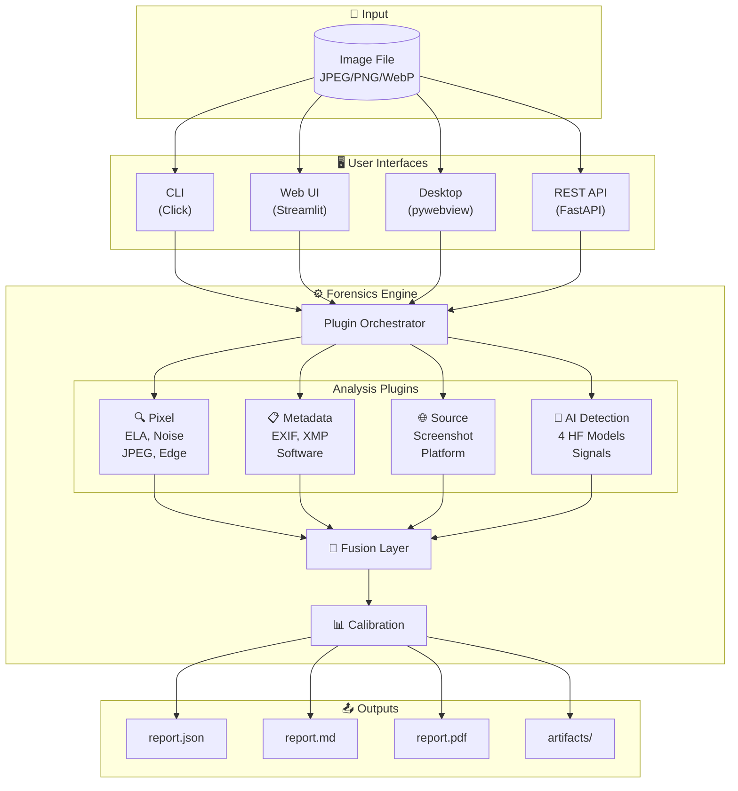
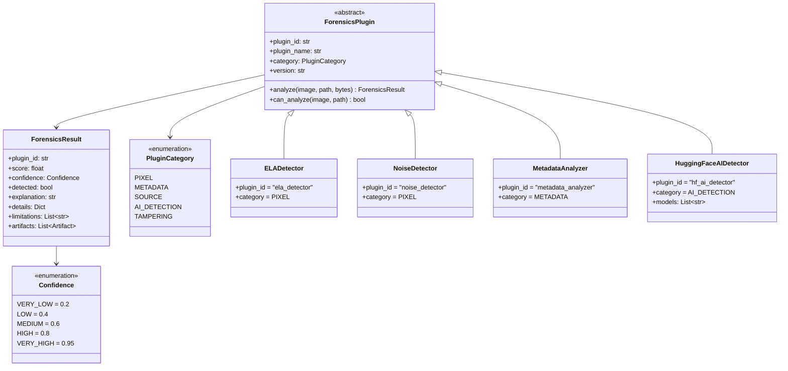
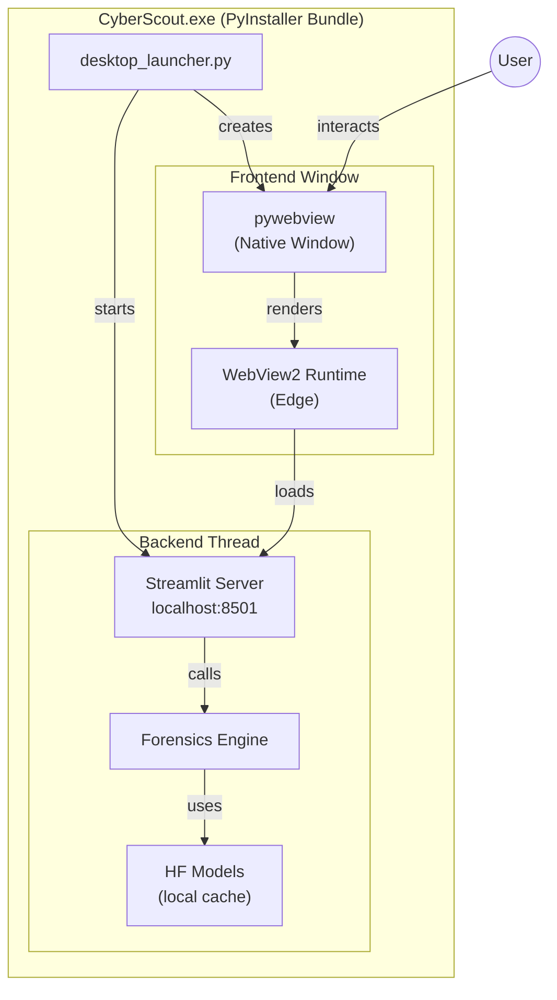

# ImageTrust / Cyber Scout - Project Diagrams

Diagrame complete ale arhitecturii și fluxului de date.

---

## 1. Arhitectura Generală a Sistemului

```
┌─────────────────────────────────────────────────────────────────────────────────────────────────────┐
│                                    IMAGETRUST / CYBER SCOUT                                         │
│                              Forensic AI Image Detection System                                     │
└─────────────────────────────────────────────────────────────────────────────────────────────────────┘

                                         ┌─────────────┐
                                         │    USER     │
                                         └──────┬──────┘
                                                │
                    ┌───────────────────────────┼───────────────────────────┐
                    │                           │                           │
                    ▼                           ▼                           ▼
        ┌───────────────────┐       ┌───────────────────┐       ┌───────────────────┐
        │   Desktop App     │       │     Web UI        │       │      CLI          │
        │   (CyberScout)    │       │   (Streamlit)     │       │    (Click)        │
        │                   │       │                   │       │                   │
        │  ┌─────────────┐  │       │  cyber_app.py     │       │  main.py          │
        │  │  pywebview  │  │       │  app.py           │       │  cli.py           │
        │  │  (native)   │  │       │  localhost:8501   │       │                   │
        │  └─────────────┘  │       │                   │       │                   │
        └─────────┬─────────┘       └─────────┬─────────┘       └─────────┬─────────┘
                  │                           │                           │
                  │                           │                           │
                  └───────────────────────────┼───────────────────────────┘
                                              │
                                              ▼
        ┌─────────────────────────────────────────────────────────────────────────────────────────┐
        │                                   REST API (FastAPI)                                     │
        │                                   localhost:8000                                         │
        │  ┌─────────────────┐  ┌─────────────────┐  ┌─────────────────┐  ┌─────────────────┐    │
        │  │ POST /analyze   │  │ POST /batch     │  │ GET /health     │  │ GET /model-info │    │
        │  └─────────────────┘  └─────────────────┘  └─────────────────┘  └─────────────────┘    │
        └─────────────────────────────────────────────┬───────────────────────────────────────────┘
                                                      │
                                                      ▼
┌─────────────────────────────────────────────────────────────────────────────────────────────────────┐
│                                      FORENSICS ENGINE                                               │
│                                      (engine.py)                                                    │
│  ┌────────────────────────────────────────────────────────────────────────────────────────────┐    │
│  │                              Plugin Orchestrator                                            │    │
│  │   • Loads registered plugins from registry                                                 │    │
│  │   • Checks can_analyze() for each plugin                                                   │    │
│  │   • Executes plugins (parallel where possible)                                             │    │
│  │   • Collects ForensicsResult objects                                                       │    │
│  └────────────────────────────────────────────────────────────────────────────────────────────┘    │
│                                              │                                                      │
│              ┌───────────────┬───────────────┼───────────────┬───────────────┐                     │
│              │               │               │               │               │                     │
│              ▼               ▼               ▼               ▼               ▼                     │
│  ┌───────────────┐ ┌───────────────┐ ┌───────────────┐ ┌───────────────┐ ┌───────────────┐        │
│  │  PIXEL PACK   │ │ METADATA PACK │ │  SOURCE PACK  │ │   AI PACK     │ │ TAMPERING     │        │
│  │               │ │               │ │               │ │               │ │ (future)      │        │
│  │ • ELA         │ │ • EXIF/XMP    │ │ • Screenshot  │ │ • HF Models   │ │               │        │
│  │ • Noise       │ │ • Software    │ │ • Platform    │ │ • Frequency   │ │ • Copy-Move   │        │
│  │ • JPEG        │ │ • Thumbnail   │ │ • Compression │ │ • Texture     │ │ • Splicing    │        │
│  │ • Resampling  │ │               │ │               │ │ • Noise       │ │               │        │
│  │ • Edge Halo   │ │               │ │               │ │ • Edge/Color  │ │               │        │
│  └───────┬───────┘ └───────┬───────┘ └───────┬───────┘ └───────┬───────┘ └───────┬───────┘        │
│          │                 │                 │                 │                 │                 │
│          └─────────────────┴─────────────────┴─────────────────┴─────────────────┘                 │
│                                              │                                                      │
│                                              ▼                                                      │
│  ┌────────────────────────────────────────────────────────────────────────────────────────────┐    │
│  │                                    FUSION LAYER                                            │    │
│  │                                    (fusion.py)                                             │    │
│  │                                                                                            │    │
│  │   ┌──────────────────────────────────────────────────────────────────────────────────┐    │    │
│  │   │  Multi-Label Verdict Computation:                                                 │    │    │
│  │   │                                                                                   │    │    │
│  │   │  P(AI_GENERATED)    ←── AI Pack scores + frequency signals                       │    │    │
│  │   │  P(EDITED)          ←── Pixel anomalies + software traces                        │    │    │
│  │   │  P(SCREENSHOT)      ←── Resolution match + aspect ratio                          │    │    │
│  │   │  P(SOCIAL_MEDIA)    ←── Platform signatures + compression                        │    │    │
│  │   │  P(CAMERA_ORIGINAL) ←── Valid EXIF + no anomalies                                │    │    │
│  │   │  P(METADATA_STRIPPED) ←── Missing EXIF indicators                                │    │    │
│  │   └──────────────────────────────────────────────────────────────────────────────────┘    │    │
│  │                                              │                                             │    │
│  │   ┌──────────────────────────────────────────┴─────────────────────────────────────┐     │    │
│  │   │  Contradiction Detection:                                                       │     │    │
│  │   │  • "Has EXIF" + "High AI score" → CONTRADICTION                                │     │    │
│  │   │  • "Photoshop trace" + "No pixel evidence" → SUSPICIOUS                        │     │    │
│  │   └──────────────────────────────────────────┬─────────────────────────────────────┘     │    │
│  │                                              │                                             │    │
│  │   ┌──────────────────────────────────────────┴─────────────────────────────────────┐     │    │
│  │   │  Final Verdict Logic:                                                           │     │    │
│  │   │  • max(probabilities) < 0.4  →  UNKNOWN/INCONCLUSIVE                           │     │    │
│  │   │  • contradictions.severe     →  UNKNOWN with warnings                          │     │    │
│  │   │  • else                      →  Highest probability label                      │     │    │
│  │   └────────────────────────────────────────────────────────────────────────────────┘     │    │
│  └────────────────────────────────────────────────────────────────────────────────────────────┘    │
└─────────────────────────────────────────────────────────────────────────────────────────────────────┘
                                                      │
                                                      ▼
        ┌─────────────────────────────────────────────────────────────────────────────────────────┐
        │                                    OUTPUT LAYER                                          │
        │  ┌─────────────────┐  ┌─────────────────┐  ┌─────────────────┐  ┌─────────────────┐    │
        │  │  report.json    │  │  report.md      │  │  report.pdf     │  │  artifacts/     │    │
        │  │  (structured)   │  │  (readable)     │  │  (professional) │  │  (heatmaps)     │    │
        │  └─────────────────┘  └─────────────────┘  └─────────────────┘  └─────────────────┘    │
        └─────────────────────────────────────────────────────────────────────────────────────────┘
```

---

## 2. Structura Repository-ului

```
imagetrust/
│
├─────────────────────────────────────────────────────────────────────────────────────────────────
│                                    SOURCE CODE
├─────────────────────────────────────────────────────────────────────────────────────────────────
│
├── src/imagetrust/
│   │
│   ├── core/                          ◄─── Configuration & Types
│   │   ├── config.py                       Settings (Pydantic)
│   │   ├── types.py                        DetectionVerdict, Confidence, etc.
│   │   └── exceptions.py                   Custom exceptions
│   │
│   ├── detection/                     ◄─── ML Detection Module
│   │   ├── detector.py                     AIDetector (main orchestrator)
│   │   ├── multi_detector.py               ComprehensiveDetector (4 HF models)
│   │   ├── calibration.py                  Temperature/Platt/Isotonic + ECE
│   │   ├── preprocessing.py                Image normalization
│   │   ├── copy_move_detector.py           Splicing detection
│   │   ├── generator_identifier.py         DALL-E/Midjourney/SD attribution
│   │   └── models/
│   │       ├── base.py                     BaseDetector ABC
│   │       ├── cnn_detector.py             ResNet/EfficientNet/ConvNext
│   │       ├── vit_detector.py             Vision Transformer
│   │       ├── hf_detector.py              HuggingFace wrapper
│   │       └── ensemble.py                 Model ensemble
│   │
│   ├── forensics/                     ◄─── Plugin-Based Forensics
│   │   ├── base.py                         ForensicsPlugin, ForensicsResult
│   │   ├── engine.py                       ForensicsEngine orchestrator
│   │   ├── fusion.py                       FusionLayer, multi-label verdicts
│   │   ├── pixel_forensics.py              ELA, Noise, JPEG, Resampling, Edge
│   │   ├── metadata_forensics.py           EXIF, Software, Thumbnail
│   │   ├── source_detection.py             Screenshot, Platform, Compression
│   │   └── ai_detection.py                 HuggingFace AI detector wrapper
│   │
│   ├── baselines/                     ◄─── Thesis Baselines (Comparison)
│   │   ├── base.py                         BaselineDetector ABC
│   │   ├── registry.py                     @register_baseline decorator
│   │   ├── classical_baseline.py           B1: LogReg/XGBoost
│   │   ├── cnn_baseline.py                 B2: ResNet50
│   │   ├── vit_baseline.py                 B3: ViT/CLIP
│   │   └── imagetrust_wrapper.py           Our system as baseline
│   │
│   ├── evaluation/                    ◄─── Evaluation Protocols
│   │   ├── metrics.py                      Acc, F1, AUC, ECE
│   │   ├── benchmark.py                    Overall comparison
│   │   ├── cross_generator.py              Train A → Test B/C/D
│   │   ├── degradation.py                  JPEG, resize, blur, noise
│   │   └── ablation.py                     Component contribution
│   │
│   ├── explainability/                ◄─── Visual Explanations
│   │   ├── gradcam.py                      Grad-CAM heatmaps
│   │   ├── patch_analysis.py               Patch-level scoring
│   │   ├── frequency.py                    FFT visualization
│   │   └── visualizations.py               Plotting utilities
│   │
│   ├── metadata/                      ◄─── Metadata Analysis
│   │   ├── exif_parser.py                  EXIF extraction
│   │   ├── xmp_parser.py                   XMP extraction
│   │   ├── c2pa_validator.py               Content Credentials
│   │   └── provenance.py                   Provenance chain
│   │
│   ├── reporting/                     ◄─── Report Generation
│   │   ├── forensic_report.py              JSON/MD/PDF/HTML
│   │   └── exporters.py                    Format converters
│   │
│   ├── frontend/                      ◄─── User Interfaces
│   │   ├── app.py                          Streamlit (original)
│   │   ├── cyber_app.py                    Cyber Scout UI
│   │   └── desktop_launcher.py             pywebview wrapper
│   │
│   ├── desktop/                       ◄─── Qt Desktop App
│   │   └── app.py                          PySide6 GUI
│   │
│   ├── api/                           ◄─── REST API
│   │   ├── main.py                         FastAPI app
│   │   ├── routes.py                       Endpoints
│   │   └── schemas.py                      Request/Response models
│   │
│   ├── data/                          ◄─── Data Management
│   │   ├── dataset.py                      Dataset loading
│   │   ├── generators.py                   Generator identification
│   │   └── splits.py                       Train/val/test splits
│   │
│   ├── utils/                         ◄─── Utilities
│   │   ├── logging.py                      Loguru setup
│   │   ├── helpers.py                      General utilities
│   │   ├── image_utils.py                  Image operations
│   │   └── scoring.py                      Confidence scoring
│   │
│   ├── cli.py                         ◄─── CLI Entry Point
│   ├── desktop_app.py                 ◄─── Legacy Tkinter App
│   ├── __init__.py                         Version info
│   └── __main__.py                         python -m entry
│
├─────────────────────────────────────────────────────────────────────────────────────────────────
│                                    TESTS
├─────────────────────────────────────────────────────────────────────────────────────────────────
│
├── tests/
│   ├── conftest.py                    ◄─── Shared fixtures
│   ├── unit/
│   │   ├── test_detection.py               Detector tests
│   │   ├── test_metadata.py                Metadata tests
│   │   └── test_forensics.py               Plugin tests
│   └── integration/
│       ├── test_detection_pipeline.py      E2E detection
│       └── test_api.py                     API tests
│
├─────────────────────────────────────────────────────────────────────────────────────────────────
│                                    SCRIPTS & CONFIG
├─────────────────────────────────────────────────────────────────────────────────────────────────
│
├── scripts/
│   ├── build_desktop.py               ◄─── Build Windows EXE
│   ├── download_models.py                  Download HF models
│   ├── run_evaluation.py                   Main evaluation
│   ├── run_baselines.py                    Train baselines
│   ├── run_ablation.py                     Ablation study
│   ├── evaluate_calibration.py             ECE analysis
│   ├── generate_tables.py                  LaTeX tables
│   └── generate_figures.py                 Publication figures
│
├── configs/
│   └── default.yaml                   ◄─── Default configuration
│
├── assets/
│   └── ui/
│       ├── landing_bg.png             ◄─── UI backgrounds
│       └── results_bg.png
│
├── docs/
│   ├── architecture.md                ◄─── Technical docs
│   ├── threat_model.md                     Security limitations
│   ├── ACADEMIC_EVALUATION.md              Thesis protocol
│   └── ARCHITECTURE_WALKTHROUGH.md         This document
│
├── .github/workflows/
│   ├── ci.yml                         ◄─── CI pipeline
│   └── release.yml                         Release automation
│
├─────────────────────────────────────────────────────────────────────────────────────────────────
│                                    BUILD & ENTRY
├─────────────────────────────────────────────────────────────────────────────────────────────────
│
├── main.py                            ◄─── CLI entry point
├── CyberScout.spec                    ◄─── PyInstaller (Streamlit)
├── ImageTrust.spec                    ◄─── PyInstaller (Qt)
├── Makefile                           ◄─── Dev commands
├── pyproject.toml                     ◄─── Project config
├── requirements.txt                   ◄─── Dependencies
└── requirements-dev.txt               ◄─── Dev dependencies
```

---

## 3. Fluxul de Date - Analiză Completă

```
┌─────────────────────────────────────────────────────────────────────────────────────────────────────┐
│                                    DATA FLOW DIAGRAM                                                │
└─────────────────────────────────────────────────────────────────────────────────────────────────────┘

    ┌─────────────┐
    │ INPUT IMAGE │
    │ (JPEG/PNG)  │
    └──────┬──────┘
           │
           ▼
    ┌─────────────────────────────────────────────────────────────────────┐
    │                         IMAGE LOADER                                 │
    │  ┌─────────────┐  ┌─────────────┐  ┌─────────────┐                 │
    │  │ PIL.Image   │  │ Raw Bytes   │  │ File Path   │                 │
    │  │ (decoded)   │  │ (binary)    │  │ (metadata)  │                 │
    │  └──────┬──────┘  └──────┬──────┘  └──────┬──────┘                 │
    └─────────┼────────────────┼────────────────┼─────────────────────────┘
              │                │                │
              └────────────────┼────────────────┘
                               │
                               ▼
    ┌─────────────────────────────────────────────────────────────────────┐
    │                      PREPROCESSING                                   │
    │                                                                      │
    │  ┌───────────────────────────────────────────────────────────────┐  │
    │  │  • Resize to model input size (224x224, 384x384)              │  │
    │  │  • Normalize: (pixel - mean) / std                            │  │
    │  │  • Convert: RGB, tensor format                                │  │
    │  │  • Augmentation (eval): none / test-time augmentation         │  │
    │  └───────────────────────────────────────────────────────────────┘  │
    └──────────────────────────────┬──────────────────────────────────────┘
                                   │
           ┌───────────────────────┼───────────────────────┐
           │                       │                       │
           ▼                       ▼                       ▼
    ┌─────────────┐         ┌─────────────┐         ┌─────────────┐
    │ PIXEL       │         │ METADATA    │         │ AI          │
    │ ANALYSIS    │         │ ANALYSIS    │         │ DETECTION   │
    └──────┬──────┘         └──────┬──────┘         └──────┬──────┘
           │                       │                       │
           ▼                       ▼                       ▼
    ┌─────────────┐         ┌─────────────┐         ┌─────────────┐
    │ ELA         │         │ EXIF Parse  │         │ HF Model 1  │
    │ ──────────  │         │ ──────────  │         │ umm-maybe   │
    │ score: 0.72 │         │ Camera: Yes │         │ score: 0.91 │
    │ conf: HIGH  │         │ Software: ? │         │             │
    └──────┬──────┘         └──────┬──────┘         └──────┬──────┘
           │                       │                       │
           ▼                       ▼                       ▼
    ┌─────────────┐         ┌─────────────┐         ┌─────────────┐
    │ Noise       │         │ XMP Parse   │         │ HF Model 2  │
    │ ──────────  │         │ ──────────  │         │ Organika    │
    │ score: 0.45 │         │ History: [] │         │ score: 0.88 │
    │ conf: MED   │         │             │         │             │
    └──────┬──────┘         └──────┬──────┘         └──────┬──────┘
           │                       │                       │
           ▼                       ▼                       ▼
    ┌─────────────┐         ┌─────────────┐         ┌─────────────┐
    │ JPEG Ghost  │         │ Software    │         │ HF Model 3  │
    │ ──────────  │         │ Traces      │         │ AIorNot     │
    │ score: 0.30 │         │ ──────────  │         │ score: 0.85 │
    │ conf: LOW   │         │ None found  │         │             │
    └──────┬──────┘         └──────┬──────┘         └──────┬──────┘
           │                       │                       │
           ▼                       ▼                       ▼
    ┌─────────────┐         ┌─────────────┐         ┌─────────────┐
    │ Resampling  │         │ Thumbnail   │         │ HF Model 4  │
    │ ──────────  │         │ Mismatch    │         │ NYUAD 2025  │
    │ score: 0.15 │         │ ──────────  │         │ score: 0.93 │
    │ conf: LOW   │         │ No thumb    │         │             │
    └──────┬──────┘         └──────┬──────┘         └──────┬──────┘
           │                       │                       │
           ▼                       ▼                       ▼
    ┌─────────────┐         ┌─────────────┐         ┌─────────────┐
    │ Edge Halo   │         │ Screenshot  │         │ Frequency   │
    │ ──────────  │         │ Detection   │         │ Analysis    │
    │ score: 0.20 │         │ ──────────  │         │ ──────────  │
    │ conf: LOW   │         │ score: 0.10 │         │ score: 0.78 │
    └──────┬──────┘         └──────┬──────┘         └──────┬──────┘
           │                       │                       │
           └───────────────────────┼───────────────────────┘
                                   │
                                   ▼
    ┌─────────────────────────────────────────────────────────────────────┐
    │                       RESULT AGGREGATION                             │
    │                                                                      │
    │   ForensicsResult[]                                                  │
    │   ┌─────────────────────────────────────────────────────────────┐   │
    │   │ [                                                            │   │
    │   │   {plugin: "ela", score: 0.72, conf: HIGH, detected: true},  │   │
    │   │   {plugin: "noise", score: 0.45, conf: MED, detected: false},│   │
    │   │   {plugin: "jpeg", score: 0.30, conf: LOW, detected: false}, │   │
    │   │   {plugin: "hf_ai", score: 0.89, conf: V_HIGH, detected: true│   │
    │   │   ...                                                        │   │
    │   │ ]                                                            │   │
    │   └─────────────────────────────────────────────────────────────┘   │
    └──────────────────────────────┬──────────────────────────────────────┘
                                   │
                                   ▼
    ┌─────────────────────────────────────────────────────────────────────┐
    │                        FUSION LAYER                                  │
    │                                                                      │
    │   Step 1: Compute Label Probabilities                               │
    │   ┌─────────────────────────────────────────────────────────────┐   │
    │   │  AI_GENERATED:    0.89  ████████████████████░░░░            │   │
    │   │  EDITED:          0.35  ███████░░░░░░░░░░░░░░░░░            │   │
    │   │  CAMERA_ORIGINAL: 0.08  ██░░░░░░░░░░░░░░░░░░░░░░            │   │
    │   │  SCREENSHOT:      0.05  █░░░░░░░░░░░░░░░░░░░░░░░            │   │
    │   │  SOCIAL_MEDIA:    0.12  ███░░░░░░░░░░░░░░░░░░░░░            │   │
    │   └─────────────────────────────────────────────────────────────┘   │
    │                                                                      │
    │   Step 2: Check Contradictions                                      │
    │   ┌─────────────────────────────────────────────────────────────┐   │
    │   │  ✓ No EXIF + High AI score = Consistent                     │   │
    │   │  ✓ No software traces + AI detected = Consistent            │   │
    │   │  ✗ (if had EXIF + AI = Contradiction → flag)                │   │
    │   └─────────────────────────────────────────────────────────────┘   │
    │                                                                      │
    │   Step 3: Determine Verdict                                         │
    │   ┌─────────────────────────────────────────────────────────────┐   │
    │   │  max(probs) = 0.89 > 0.4 threshold                          │   │
    │   │  No severe contradictions                                    │   │
    │   │  → PRIMARY VERDICT: AI_GENERATED                            │   │
    │   │  → CONFIDENCE: VERY_HIGH                                    │   │
    │   │  → AUTHENTICITY SCORE: 0.08                                 │   │
    │   └─────────────────────────────────────────────────────────────┘   │
    └──────────────────────────────┬──────────────────────────────────────┘
                                   │
                                   ▼
    ┌─────────────────────────────────────────────────────────────────────┐
    │                      CALIBRATION LAYER                               │
    │                                                                      │
    │   ┌─────────────────────────────────────────────────────────────┐   │
    │   │  Raw probability: 0.89                                       │   │
    │   │  Temperature scaling: T = 1.5                                │   │
    │   │  Calibrated: softmax(logits / T) = 0.82                     │   │
    │   │                                                              │   │
    │   │  ECE (Expected Calibration Error): 0.03                     │   │
    │   └─────────────────────────────────────────────────────────────┘   │
    └──────────────────────────────┬──────────────────────────────────────┘
                                   │
                                   ▼
    ┌─────────────────────────────────────────────────────────────────────┐
    │                       FINAL OUTPUT                                   │
    │                                                                      │
    │   ForensicsVerdict                                                  │
    │   ┌─────────────────────────────────────────────────────────────┐   │
    │   │  {                                                           │   │
    │   │    "primary_label": "AI_GENERATED",                         │   │
    │   │    "confidence": "VERY_HIGH",                               │   │
    │   │    "authenticity_score": 0.08,                              │   │
    │   │    "calibrated_probability": 0.82,                          │   │
    │   │    "label_probabilities": {                                 │   │
    │   │      "ai_generated": 0.89,                                  │   │
    │   │      "edited": 0.35,                                        │   │
    │   │      "camera_original": 0.08,                               │   │
    │   │      ...                                                    │   │
    │   │    },                                                       │   │
    │   │    "evidence": [                                            │   │
    │   │      "4/4 AI detectors classify as synthetic",              │   │
    │   │      "High frequency anomalies detected",                   │   │
    │   │      "No camera EXIF metadata"                              │   │
    │   │    ],                                                       │   │
    │   │    "contradictions": [],                                    │   │
    │   │    "limitations": [                                         │   │
    │   │      "New generators may evade detection"                   │   │
    │   │    ]                                                        │   │
    │   │  }                                                          │   │
    │   └─────────────────────────────────────────────────────────────┘   │
    └──────────────────────────────┬──────────────────────────────────────┘
                                   │
           ┌───────────────────────┼───────────────────────┐
           │                       │                       │
           ▼                       ▼                       ▼
    ┌─────────────┐         ┌─────────────┐         ┌─────────────┐
    │ report.json │         │ report.md   │         │ artifacts/  │
    │ (structured)│         │ (readable)  │         │ (heatmaps)  │
    └─────────────┘         └─────────────┘         └─────────────┘
```

---

## 4. Mermaid Diagrams

### 4.1 System Overview (Mermaid)



### 4.2 Plugin Architecture (Mermaid)



### 4.3 Verdict Flow (Mermaid)

```mermaid
flowchart TD
    START([Plugin Results]) --> AGG[Aggregate Scores]

    AGG --> PROB[Compute Label Probabilities]

    PROB --> AI_P["P(AI_GENERATED)"]
    PROB --> ED_P["P(EDITED)"]
    PROB --> CAM_P["P(CAMERA_ORIGINAL)"]
    PROB --> SCR_P["P(SCREENSHOT)"]
    PROB --> SOC_P["P(SOCIAL_MEDIA)"]

    AI_P & ED_P & CAM_P & SCR_P & SOC_P --> CHECK{max(P) > 0.4?}

    CHECK -->|No| UNK[/"UNKNOWN<br/>Insufficient Evidence"/]
    CHECK -->|Yes| CONTRA{Contradictions?}

    CONTRA -->|Severe| UNK_W[/"UNKNOWN<br/>+ Warnings"/]
    CONTRA -->|None/Minor| SELECT[Select Highest P]

    SELECT --> VERDICT[/"PRIMARY VERDICT<br/>+ Confidence<br/>+ Evidence"/]

    VERDICT --> CAL[Apply Calibration]
    CAL --> FINAL([Final ForensicsVerdict])

    style UNK fill:#ff9800
    style UNK_W fill:#ff9800
    style VERDICT fill:#4caf50
    style FINAL fill:#2196f3
```

### 4.4 Desktop App Architecture (Mermaid)



---

## 5. Comparație Baseline-uri (Thesis)

```
┌─────────────────────────────────────────────────────────────────────────────────────────────────────┐
│                              BASELINE COMPARISON ARCHITECTURE                                        │
└─────────────────────────────────────────────────────────────────────────────────────────────────────┘

                    ┌───────────────────────────────────────────────────────────────┐
                    │                      SAME TEST SET                             │
                    │                    (held-out data)                             │
                    └───────────────────────────────────┬───────────────────────────┘
                                                        │
        ┌───────────────────────────────────────────────┼───────────────────────────────────────────┐
        │                                               │                                           │
        ▼                                               ▼                                           ▼
┌───────────────────┐                       ┌───────────────────┐                       ┌───────────────────┐
│  BASELINE 1       │                       │  BASELINE 2       │                       │  BASELINE 3       │
│  Classical ML     │                       │  CNN              │                       │  ViT/CLIP         │
├───────────────────┤                       ├───────────────────┤                       ├───────────────────┤
│                   │                       │                   │                       │                   │
│  Features:        │                       │  Model:           │                       │  Model:           │
│  • DCT stats      │                       │  • ResNet-50      │                       │  • ViT-B/16       │
│  • Noise profile  │                       │  • pretrained     │                       │  • CLIP-ViT-L     │
│  • Edge histogram │                       │  • fine-tuned     │                       │  • pretrained     │
│  • Color stats    │                       │                   │                       │                   │
│                   │                       │  Input:           │                       │  Input:           │
│  Classifier:      │                       │  • 224x224        │                       │  • 224x224        │
│  • LogReg         │                       │  • normalized     │                       │  • normalized     │
│  • XGBoost        │                       │                   │                       │                   │
│                   │                       │                   │                       │                   │
└─────────┬─────────┘                       └─────────┬─────────┘                       └─────────┬─────────┘
          │                                           │                                           │
          ▼                                           ▼                                           ▼
┌───────────────────┐                       ┌───────────────────┐                       ┌───────────────────┐
│  Predictions      │                       │  Predictions      │                       │  Predictions      │
│  + Calibration    │                       │  + Calibration    │                       │  + Calibration    │
└─────────┬─────────┘                       └─────────┬─────────┘                       └─────────┬─────────┘
          │                                           │                                           │
          └───────────────────────────────────────────┼───────────────────────────────────────────┘
                                                      │
                                                      ▼
                    ┌─────────────────────────────────────────────────────────────────┐
                    │                      IMAGETRUST                                  │
                    │                   (Our System)                                   │
                    ├─────────────────────────────────────────────────────────────────┤
                    │                                                                  │
                    │  Components:                                                     │
                    │  • 4 HuggingFace models (ensemble)                              │
                    │  • Signal analysis (frequency, texture, noise)                  │
                    │  • Pixel forensics (ELA, JPEG, resampling)                      │
                    │  • Metadata analysis                                            │
                    │  • Fusion layer (multi-label)                                   │
                    │  • Calibration (temperature scaling)                            │
                    │                                                                  │
                    └───────────────────────────────┬─────────────────────────────────┘
                                                    │
                                                    ▼
                    ┌─────────────────────────────────────────────────────────────────┐
                    │                      EVALUATION METRICS                          │
                    │                    (Same for all methods)                        │
                    ├─────────────────────────────────────────────────────────────────┤
                    │                                                                  │
                    │  ┌─────────────┐ ┌─────────────┐ ┌─────────────┐ ┌───────────┐  │
                    │  │  Accuracy   │ │  F1 Score   │ │  AUC-ROC    │ │    ECE    │  │
                    │  └─────────────┘ └─────────────┘ └─────────────┘ └───────────┘  │
                    │                                                                  │
                    │  ┌─────────────────────────────────────────────────────────────┐ │
                    │  │  Cross-Generator: Train on A, Test on B/C/D                 │ │
                    │  └─────────────────────────────────────────────────────────────┘ │
                    │                                                                  │
                    │  ┌─────────────────────────────────────────────────────────────┐ │
                    │  │  Degradation: JPEG Q, Resize, Blur, Noise                   │ │
                    │  └─────────────────────────────────────────────────────────────┘ │
                    │                                                                  │
                    └─────────────────────────────────────────────────────────────────┘
```

---

## 6. CI/CD Pipeline

```
┌─────────────────────────────────────────────────────────────────────────────────────────────────────┐
│                                    CI/CD PIPELINE                                                    │
└─────────────────────────────────────────────────────────────────────────────────────────────────────┘

    ┌──────────────┐
    │  Developer   │
    │  git push    │
    └──────┬───────┘
           │
           ▼
    ┌──────────────────────────────────────────────────────────────────────────────────────────────┐
    │                                    GitHub Actions                                             │
    │                                    (.github/workflows/ci.yml)                                 │
    │                                                                                               │
    │   ┌─────────────────────────────────────────────────────────────────────────────────────┐    │
    │   │  Trigger: push to main, pull_request                                                │    │
    │   └─────────────────────────────────────────────────────────────────────────────────────┘    │
    │                                           │                                                   │
    │           ┌───────────────────────────────┼───────────────────────────────┐                  │
    │           │                               │                               │                  │
    │           ▼                               ▼                               ▼                  │
    │   ┌───────────────┐               ┌───────────────┐               ┌───────────────┐         │
    │   │     LINT      │               │   TYPECHECK   │               │     TEST      │         │
    │   │               │               │               │               │               │         │
    │   │ • black       │               │ • mypy        │               │ • pytest      │         │
    │   │ • isort       │               │ • strict mode │               │ • unit tests  │         │
    │   │ • ruff        │               │               │               │ • coverage    │         │
    │   │               │               │               │               │               │         │
    │   │ [~30 sec]     │               │ [~1 min]      │               │ [~2 min]      │         │
    │   └───────┬───────┘               └───────┬───────┘               └───────┬───────┘         │
    │           │                               │                               │                  │
    │           └───────────────────────────────┼───────────────────────────────┘                  │
    │                                           │                                                   │
    │                                           ▼                                                   │
    │                                   ┌───────────────┐                                          │
    │                                   │   BUILD EXE   │                                          │
    │                                   │               │                                          │
    │                                   │ • PyInstaller │                                          │
    │                                   │ • Windows     │                                          │
    │                                   │ • Verify only │                                          │
    │                                   │               │                                          │
    │                                   │ [~5 min]      │                                          │
    │                                   └───────┬───────┘                                          │
    │                                           │                                                   │
    └───────────────────────────────────────────┼───────────────────────────────────────────────────┘
                                                │
                                                ▼
    ┌──────────────────────────────────────────────────────────────────────────────────────────────┐
    │                                    RELEASE PIPELINE                                           │
    │                                    (.github/workflows/release.yml)                            │
    │                                                                                               │
    │   ┌─────────────────────────────────────────────────────────────────────────────────────┐    │
    │   │  Trigger: tag push (v*)                                                             │    │
    │   └─────────────────────────────────────────────────────────────────────────────────────┘    │
    │                                           │                                                   │
    │                                           ▼                                                   │
    │                               ┌───────────────────────┐                                      │
    │                               │   BUILD RELEASE       │                                      │
    │                               │                       │                                      │
    │                               │ • Build Windows EXE   │                                      │
    │                               │ • Create ZIP archive  │                                      │
    │                               │ • Generate changelog  │                                      │
    │                               │                       │                                      │
    │                               └───────────┬───────────┘                                      │
    │                                           │                                                   │
    │                                           ▼                                                   │
    │                               ┌───────────────────────┐                                      │
    │                               │   GITHUB RELEASE      │                                      │
    │                               │                       │                                      │
    │                               │ • Upload artifacts    │                                      │
    │                               │ • Release notes       │                                      │
    │                               │ • Tag version         │                                      │
    │                               │                       │                                      │
    │                               └───────────────────────┘                                      │
    │                                                                                               │
    └───────────────────────────────────────────────────────────────────────────────────────────────┘
```

---

## 7. Deployment Architecture

```
┌─────────────────────────────────────────────────────────────────────────────────────────────────────┐
│                                  DEPLOYMENT OPTIONS                                                  │
└─────────────────────────────────────────────────────────────────────────────────────────────────────┘

┌─────────────────────────────────────────────────────────────────────────────────────────────────────┐
│  OPTION 1: Desktop Application (Primary - Thesis Deliverable)                                       │
│                                                                                                      │
│   ┌─────────────────────────────────────────────────────────────────────────────────────────────┐   │
│   │                                                                                              │   │
│   │      User's Windows PC                                                                       │   │
│   │      ┌─────────────────────────────────────────────────────────────────────────────────┐    │   │
│   │      │                                                                                  │    │   │
│   │      │   CyberScout.exe                                                                │    │   │
│   │      │   ┌──────────────────────────────────────────────────────────────────────────┐  │    │   │
│   │      │   │                                                                          │  │    │   │
│   │      │   │   ┌─────────────┐    ┌─────────────┐    ┌─────────────┐                 │  │    │   │
│   │      │   │   │  pywebview  │    │  Streamlit  │    │  Forensics  │                 │  │    │   │
│   │      │   │   │  (Window)   │◄──►│  (Server)   │◄──►│  (Engine)   │                 │  │    │   │
│   │      │   │   └─────────────┘    └─────────────┘    └──────┬──────┘                 │  │    │   │
│   │      │   │                                                │                        │  │    │   │
│   │      │   │                                         ┌──────▼──────┐                 │  │    │   │
│   │      │   │                                         │  HF Models  │                 │  │    │   │
│   │      │   │                                         │  (cached)   │                 │  │    │   │
│   │      │   │                                         └─────────────┘                 │  │    │   │
│   │      │   │                                                                          │  │    │   │
│   │      │   └──────────────────────────────────────────────────────────────────────────┘  │    │   │
│   │      │                                                                                  │    │   │
│   │      │   ✓ Runs OFFLINE                                                                │    │   │
│   │      │   ✓ No installation required (portable)                                         │    │   │
│   │      │   ✓ Models downloaded on first run                                              │    │   │
│   │      │                                                                                  │    │   │
│   │      └─────────────────────────────────────────────────────────────────────────────────┘    │   │
│   │                                                                                              │   │
│   └─────────────────────────────────────────────────────────────────────────────────────────────┘   │
│                                                                                                      │
└─────────────────────────────────────────────────────────────────────────────────────────────────────┘

┌─────────────────────────────────────────────────────────────────────────────────────────────────────┐
│  OPTION 2: API Server (Integration/Batch Processing)                                                │
│                                                                                                      │
│   ┌────────────────────────┐         ┌────────────────────────────────────────────────────────┐    │
│   │  Client Applications   │         │              Server (Docker/VM)                        │    │
│   │                        │         │                                                        │    │
│   │  ┌─────────────────┐   │   HTTP  │   ┌─────────────────────────────────────────────────┐ │    │
│   │  │ Web Dashboard   │───┼────────►│   │              FastAPI                            │ │    │
│   │  └─────────────────┘   │         │   │              localhost:8000                     │ │    │
│   │                        │         │   │                                                 │ │    │
│   │  ┌─────────────────┐   │   HTTP  │   │   POST /api/v1/analyze                         │ │    │
│   │  │ Batch Script    │───┼────────►│   │   POST /api/v1/batch                           │ │    │
│   │  └─────────────────┘   │         │   │   GET  /api/v1/health                          │ │    │
│   │                        │         │   │                                                 │ │    │
│   │  ┌─────────────────┐   │   HTTP  │   └───────────────────────┬─────────────────────────┘ │    │
│   │  │ Mobile App      │───┼────────►│                           │                          │    │
│   │  └─────────────────┘   │         │                           ▼                          │    │
│   │                        │         │   ┌─────────────────────────────────────────────────┐ │    │
│   └────────────────────────┘         │   │              Forensics Engine                   │ │    │
│                                      │   │              (GPU optional)                     │ │    │
│                                      │   └─────────────────────────────────────────────────┘ │    │
│                                      │                                                        │    │
│                                      └────────────────────────────────────────────────────────┘    │
│                                                                                                      │
└─────────────────────────────────────────────────────────────────────────────────────────────────────┘

┌─────────────────────────────────────────────────────────────────────────────────────────────────────┐
│  OPTION 3: CLI Tool (Scripting/Automation)                                                          │
│                                                                                                      │
│   ┌─────────────────────────────────────────────────────────────────────────────────────────────┐   │
│   │                                                                                              │   │
│   │   $ imagetrust forensics image.jpg --all --output results/                                  │   │
│   │                                                                                              │   │
│   │   [████████████████████████████████████████] 100%                                           │   │
│   │                                                                                              │   │
│   │   ┌─────────────────────────────────────────────────────────────────────────────────────┐   │   │
│   │   │  VERDICT: AI_GENERATED                                                              │   │   │
│   │   │  CONFIDENCE: VERY_HIGH (0.89)                                                       │   │   │
│   │   │  AUTHENTICITY: 0.08                                                                 │   │   │
│   │   │                                                                                     │   │   │
│   │   │  Evidence:                                                                          │   │   │
│   │   │  • [AI] 4/4 detectors classify as synthetic (score: 0.91)                          │   │   │
│   │   │  • [PIXEL] ELA shows uniform error levels                                          │   │   │
│   │   │  • [META] No camera EXIF metadata found                                            │   │   │
│   │   │                                                                                     │   │   │
│   │   │  Saved: results/report.json, results/report.md                                     │   │   │
│   │   └─────────────────────────────────────────────────────────────────────────────────────┘   │   │
│   │                                                                                              │   │
│   └─────────────────────────────────────────────────────────────────────────────────────────────┘   │
│                                                                                                      │
└─────────────────────────────────────────────────────────────────────────────────────────────────────┘
```

---

## 8. Sumar Vizual

```
╔═══════════════════════════════════════════════════════════════════════════════════════════════════╗
║                                                                                                    ║
║                           I M A G E T R U S T  /  C Y B E R  S C O U T                            ║
║                                                                                                    ║
║                              Forensic AI Image Detection System                                    ║
║                                                                                                    ║
╠═══════════════════════════════════════════════════════════════════════════════════════════════════╣
║                                                                                                    ║
║   📥 INPUT          →    ⚙️ PROCESS           →    📊 ANALYZE           →    📤 OUTPUT            ║
║                                                                                                    ║
║   ┌─────────┐           ┌─────────────────┐       ┌─────────────────┐       ┌─────────────────┐   ║
║   │  Image  │    ──►    │  12+ Forensic   │  ──►  │  Multi-Label    │  ──►  │  Verdict +      │   ║
║   │  File   │           │  Plugins        │       │  Fusion         │       │  Evidence       │   ║
║   └─────────┘           └─────────────────┘       └─────────────────┘       └─────────────────┘   ║
║                                                                                                    ║
╠═══════════════════════════════════════════════════════════════════════════════════════════════════╣
║                                                                                                    ║
║   🔍 DETECTION CAPABILITIES                                                                        ║
║   ├── AI-Generated Images (DALL-E, Midjourney, Stable Diffusion)                                  ║
║   ├── Digital Manipulation (splicing, copy-move, inpainting)                                      ║
║   ├── Screenshot Detection (resolution, aspect ratio)                                             ║
║   ├── Platform Attribution (WhatsApp, Instagram, Facebook) [hints]                                ║
║   └── Metadata Analysis (EXIF, XMP, software traces)                                              ║
║                                                                                                    ║
╠═══════════════════════════════════════════════════════════════════════════════════════════════════╣
║                                                                                                    ║
║   🎯 KEY FEATURES                                                                                  ║
║   ├── Calibrated confidence scores (Temperature Scaling, ECE)                                     ║
║   ├── UNCERTAIN/INCONCLUSIVE verdicts (avoids false positives)                                    ║
║   ├── Explainable results (Grad-CAM, per-plugin evidence)                                         ║
║   ├── Multi-label output (not just binary real/fake)                                              ║
║   └── Offline operation (no cloud dependencies)                                                   ║
║                                                                                                    ║
╠═══════════════════════════════════════════════════════════════════════════════════════════════════╣
║                                                                                                    ║
║   📦 DELIVERABLES                                                                                  ║
║   ├── Desktop App (CyberScout.exe) - Windows portable                                             ║
║   ├── Web UI (Streamlit) - Browser-based                                                          ║
║   ├── CLI Tool - Scripting/automation                                                             ║
║   ├── REST API (FastAPI) - Integration                                                            ║
║   └── Forensic Reports (JSON/MD/PDF)                                                              ║
║                                                                                                    ║
╠═══════════════════════════════════════════════════════════════════════════════════════════════════╣
║                                                                                                    ║
║   🔬 THESIS COMPONENTS                                                                             ║
║   ├── 3 Baselines (Classical ML, CNN, ViT)                                                        ║
║   ├── Cross-Generator Evaluation                                                                  ║
║   ├── Degradation Robustness Study                                                                ║
║   ├── Ablation Study                                                                              ║
║   ├── Calibration Analysis (ECE, reliability diagrams)                                            ║
║   └── Threat Model Documentation                                                                  ║
║                                                                                                    ║
╚═══════════════════════════════════════════════════════════════════════════════════════════════════╝
```

---

*Document generated: 2026-01-21*
